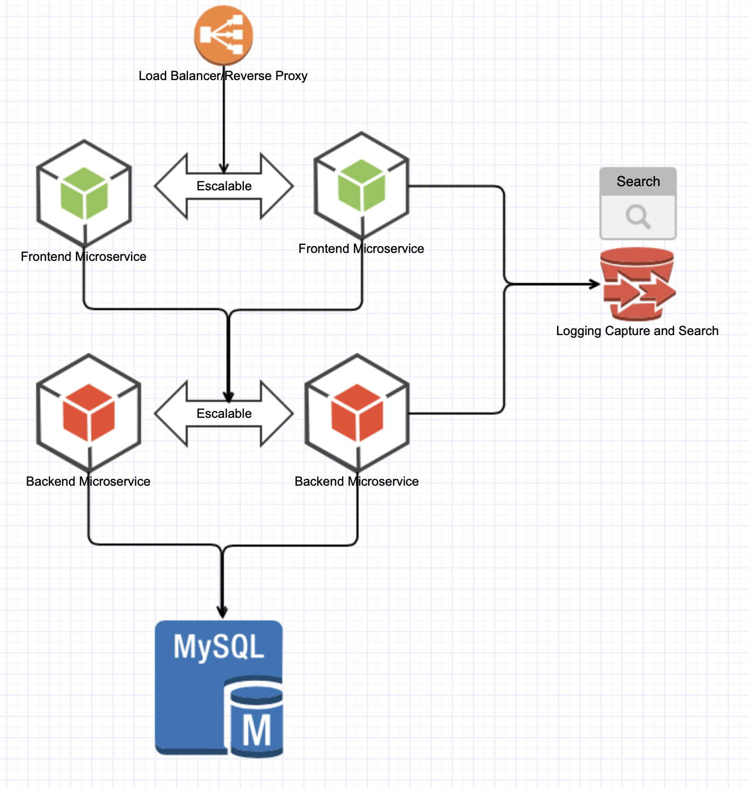

# Instrucciones para la aplicacion Desarrollada con Microservicios

## Instrucciones y Lineamientos para el desarrollo y composicion de la aplicacion con Microservicios

### Microservicio de Balanceo de Carga y Proxy Reverso

- Se tendra un microservicio que actuara como Balanceador de Carga y Proxy Reverso, el cual debera actuar como el acceso de los usuarios al servicio de frontend.
- Se recomienda el uso de traeffik, nginx o haproxy para este microservicio
- Este microservicio debe tener la capacidad de descubrir de forma automatica los microservicios de frontend y enrutar peticiones a estos a medida que son adicionaos/retirados.
- Los usuarios deben poder entrar a la aplicacion tanto por puerto 80 como por puerto 443 (TLS), para lo cual se debe generar un certificado digital.
-  - Este servicio debe estar conectado a una red exclusiva llamada front_net

### Microservicio de Frontend

- Para el desarrollo del microservicio de frontend, se puede seleccionar el lenguaje/framework de preferencia.
- Es necesario que este servicio/contenedor debe poderse escalar de forma manual
- Este servicio debe estar conectado a una red exclusiva llamada front_net
- Este servicio debe ser iniciado posterior al servicio de backend y a la BD
- El microservicio debe ser construido desde un Dockerfile propio de la app

### Microservicio de Backend

- Para el desarrollo del microservicio de frontend, se puede seleccionar el lenguaje/framework de preferencia. Se recomienda Java
- Es necesario que este servicio/contenedor debe poderse escalar de forma manual
- Este servicio debe estar conectado a una red llamada front_net y otra red back_net
- Este servicio debe ser iniciado posterior al servicio de la BD
- Es necesario restringir el uso de CPU y memoria de este microservicio a unos niveles adecuados.
- El microservicio debe ser construido desde un Dockerfile propio de la app

### Base de Datos MySQL

- Es necesario el uso de MySQL como motor de BD para la aplicacion a desarrollar
- Es necesario el manejo de credenciales de una forma que no sean visibles en el archivo docker-compose.yml
- Para la instancia de MySQL se manejara una sola instancia y es necesario que la Data pueda persistir
- Este servicio debe estar conectado a una red llamada back_net
- Este microservicio es el primero que debe ser iniciado

### Servicio de Captura y Busqueda de Logs

- Se debe contar con un servicio de recoleccion y busqueda de logs para todos los microservicios/contenedores que componen la aplicacion
- Este servicio debe estar en capacidad de recoger todos y cada uno de los logs relevantes que generen los servicios de proxy/balanceador, frontend, backend asi como del motor de BD MySQL
- Se recomienda usar opciones como Logspout y ELK.  
  
### Bonus/Valor Agregado en el Taller

- El uso del patron de Multistage Build sera un valor agregado en este taller
  